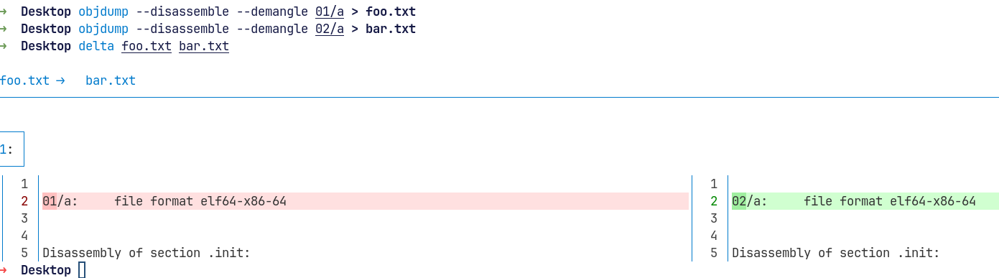

# mango

* clone the repo
* cargo build --release
* save the `release/a` binary to temp location ( I selected ~/Desktop/01/ )
* comment the code on `b` crate (see test.rs instructions)
* cargo clean ; cargo build --release
* save the `release/a` to other temp location ( I selected ~/Desktop/02/ )
* compare both bins

extra, the test env works fine we can see the println!(s) with

```shell
cargo test -- --nocapture

running 1 test
mango mango
mango_b mango
tear-ing down....
test test::test_mango ... ok

```

Comparing

```shell
➜  Desktop cmp 01/a 02/a
➜  Desktop diff 01/a 02/a
```


